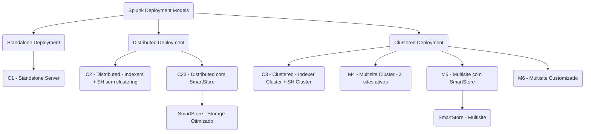

# Splunk Architecture Enablement

## Objetivo
Treinar para atingir o nível de Arquiteto de Splunk Plataforma.

---

## Plano Completo de Desenvolvimento

### Fase 1 – Fundamentos Sólidos
**Meta:** Dominar os conceitos essenciais da plataforma Splunk.

- Conceitos básicos: UF, HF, IF, Indexers, Search Heads
- Arquiteturas: Standalone, Distributed, Clustering
- Licenciamento Splunk e métricas
- Arquivos críticos: `indexes.conf`, `inputs.conf`, `outputs.conf`, `serverclass.conf`
- Hands-on: instalação e configuração mínima de Splunk e Universal Forwarder
- Construção de uma topologia inicial em papel

---

### Fase 2 – Especialização em Deployments e Arquitetura
**Meta:** Capacidade de desenhar arquiteturas resilientes e escaláveis.

- Deployment Server na prática
- Cluster de Indexers (multisite, alta disponibilidade)
- Cluster de Search Heads
- Gerenciamento de certificados (SSL)
- Arquiteturas SVA Splunk para diferentes volumes
- Heavy e Intermediate Forwarders
- Segurança: HEC, RBAC, capabilities

---

### Fase 3 – Especialização de Performance e Troubleshooting
**Meta:** Ser capaz de diagnosticar, tunar e escalar o ambiente.

- Parsing pipeline e indexing pipeline
- Tuning de filas: ingestion, indexing, searching
- Search concurrency tuning
- Troubleshooting avançado: licensing issues, queue blockages, bucket recovery
- Sizing e capacity planning realista

---

# Sessão de Hoje – 1h

## Tema
**Arquitetura Splunk: Como Escolher o Modelo Certo para Cada Cenário**

## Estrutura da Sessão

| Tempo | Atividade |
|:-----:|:----------|
| 5 min | Introdução: o que define uma arquitetura boa |
| 15 min | Conceitos de topologias e tipos de forwarders |
| 20 min | Estudo de 3 mini-cenários reais |
| 15 min | Simulado ao vivo: arquitetar cenário real |
| 5 min | Recapitulação e teaser para a próxima sessão |

---

## Conteúdo Detalhado

### Introdução (5 min)
- O que é uma arquitetura eficiente: escalabilidade, resiliência, performance, operação simplificada.

### Modelos de Topologias (15 min)
- Standalone vs Distributed vs Clustered

# Splunk Validated Architectures (SVA) – Guia Baseado em SVA Oficial

## 1. Introdução ao SVA

O **Splunk Validated Architectures (SVA)** fornece modelos de referência comprovados para implementar Splunk Enterprise de forma segura, resiliente e escalável.  
Esses modelos são aplicáveis a diferentes volumes de ingestão, perfis de disponibilidade e requisitos corporativos.

SVA responde perguntas como:
- Quantos servidores preciso?
- Quando usar cluster de indexers?
- Como ter alta disponibilidade?
- Como distribuir as funções da plataforma Splunk?

---

## 2. Standalone vs Distributed vs Clustered

| Modelo       | Descrição | Quando usar |
|:-------------|:----------|:------------|
| **Standalone** | Um único servidor para indexação, busca e interface. | Pequenos ambientes (<50GB/dia), laboratórios, POCs. |
| **Distributed** | Separação de funções (UFs, Indexers, Search Head) sem clustering. | Ambientes médios a grandes (50GB-300GB/dia), início de escalabilidade. |
| **Clustered** | Uso de clusters para alta disponibilidade (Indexer e Search Head Clustering). | Ambientes críticos (>300GB/dia), necessidade de tolerância a falhas, multisite. |

**Observação:** Mesmo em arquiteturas distribuídas simples, é possível ter certa resiliência, mas apenas com clustering há HA verdadeiro.

---

## 3. Tipos de SVA e suas diferenças

### C = Clássico (Classic)
- Arquiteturas em um único data center.

| Código | Descrição |
|:------:|:----------|
| **C1** | Standalone Splunk Server |
| **C2** | Distributed Deployment (UF + Indexers + SH) sem clustering |
| **C3** | Full Clustered Deployment (Indexer Cluster + Search Head Cluster) em único data center |

### C23 = Variante especial
- Parecido com C2 (Distributed), mas usando **SmartStore** para otimizar armazenamento (dados quentes localmente, frios em storage remoto).

| Código | Descrição |
|:------:|:----------|
| **C23** | Distributed Deployment com SmartStore no Indexers (economia de storage local) |

### M = Multisite
- Arquiteturas para múltiplos data centers, com replicação entre sites.

| Código | Descrição |
|:------:|:----------|
| **M4** | Multisite Indexer Cluster (2 sites ativos) com Search Head Cluster |
| **M5** | Similar ao M4, mas com otimizações específicas de storage (SmartStore em multisite) |
| **M6** | Arquitetura multisite altamente customizada (maior resiliência possível) |

---

## 4. Quando usar cada tipo de arquitetura

| Arquitetura | Volume sugerido | Alta Disponibilidade | Uso de SmartStore | Multisite | Comentário |
|:------------|:----------------|:---------------------|:------------------|:---------|:-----------|
| **C1** | < 50GB/dia | Não | Não | Não | Apenas para POC ou ambientes mínimos |
| **C2** | 50-300GB/dia | Parcial (manualmente) | Não | Não | Separação de papéis sem HA automático |
| **C23** | 50-300GB/dia | Parcial | Sim | Não | Ideal quando storage local é caro |
| **C3** | >300GB/dia | Sim (Clustered) | Opcional | Não | Alta disponibilidade real em um único data center |
| **M4** | >300GB/dia | Sim (Multisite) | Não | Sim | Resiliência geográfica para disaster recovery |
| **M5** | >300GB/dia | Sim | Sim (SmartStore) | Sim | Otimização de storage para grandes ambientes |
| **M6** | >500GB/dia | Sim (máxima) | Customizável | Sim | Ambientes extremamente críticos |

---

## 5. Considerações Finais

- **SmartStore** é recomendado para ambientes que desejam reduzir storage local em Indexers.
- **Clustered Deployments** (C3, M4, M5, M6) são obrigatórios para alta disponibilidade e compliance.
- **Multisite** é indicado para organizações com operação crítica em múltiplos data centers ou regiões geográficas.
- Sempre considerar crescimento futuro: projetar para onde o ambiente deve ir, não apenas onde está hoje.

> **Dica:** Mesmo para clientes iniciando pequeno, é recomendado um design que permita escalar sem grandes migrações disruptivas.

---

## Referência Oficial

- [Splunk Validated Architectures (SVA) – Documentação Oficial](https://docs.splunk.com/Documentation/SVA/current/Architectures/About)

_____

_____

- Quando e como usar:
  - Universal Forwarder (UF)
  - Heavy Forwarder (HF)
  - Intermediate Forwarder (IF)

### Estudo de 3 Cenários Reais (20 min)
- **Empresa pequena (50GB/dia):**
  - UF > IDX standalone > SH
- **Empresa média (500GB/dia):**
  - UF > HF (parseo) > IDX Cluster > SH Cluster
- **Empresa grande (1TB/dia multisite):**
  - UF > IF > HF > IDX Cluster multisite > SH Cluster multisite

### Simulado ao Vivo (15 min)
- Caso: "Uma empresa projeta crescer de 100GB/dia para 500GB/dia em 2 anos."
- Atividade: participantes sugerem uma arquitetura.
- Discussão e comparação com a arquitetura recomendada.

### Encerramento (5 min)
- Reforço: elasticidade e escalabilidade como pilares.
- Teaser para próxima sessão: **Deep Dive em Indexer Cluster**.

---

# Próximos Passos
- Consolidar conceitos hoje vistos.
- Na próxima sessão: detalhes de configuração de cluster de Indexers.
