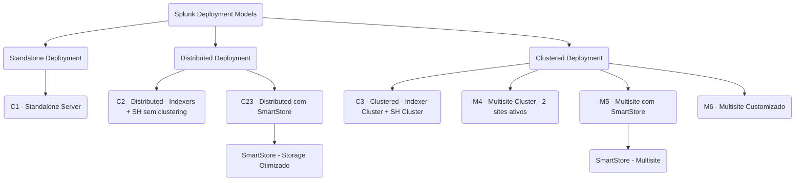

# Splunk Architecture Enablement

## Objetivo
Treinar para atingir o nível de Arquiteto de Splunk Plataforma.

---

## Plano Completo de Desenvolvimento

### Fase 1 – Fundamentos Sólidos
**Meta:** Dominar os conceitos essenciais da plataforma Splunk.

- Conceitos básicos: UF, HF, IF, Indexers, Search Heads
- Arquiteturas: Standalone, Distributed, Clustering
- Licenciamento Splunk e métricas
- Arquivos críticos: `indexes.conf`, `inputs.conf`, `outputs.conf`, `serverclass.conf`
- Hands-on: instalação e configuração mínima de Splunk e Universal Forwarder
- Construção de uma topologia inicial em papel

---

### Fase 2 – Especialização em Deployments e Arquitetura
**Meta:** Capacidade de desenhar arquiteturas resilientes e escaláveis.

- Deployment Server na prática
- Cluster de Indexers (multisite, alta disponibilidade)
- Cluster de Search Heads
- Gerenciamento de certificados (SSL)
- Arquiteturas SVA Splunk para diferentes volumes
- Heavy e Intermediate Forwarders
- Segurança: HEC, RBAC, capabilities

---

### Fase 3 – Especialização de Performance e Troubleshooting
**Meta:** Ser capaz de diagnosticar, tunar e escalar o ambiente.

- Parsing pipeline e indexing pipeline
- Tuning de filas: ingestion, indexing, searching
- Search concurrency tuning
- Troubleshooting avançado: licensing issues, queue blockages, bucket recovery
- Sizing e capacity planning realista

---

# Sessão de Hoje – 1h

## Tema
**Arquitetura Splunk: Como Escolher o Modelo Certo para Cada Cenário**

## Estrutura da Sessão

| Tempo | Atividade |
|:-----:|:----------|
| 5 min | Introdução: o que define uma arquitetura boa |
| 15 min | Conceitos de topologias e tipos de forwarders |
| 20 min | Estudo de 3 mini-cenários reais |
| 15 min | Simulado ao vivo: arquitetar cenário real |
| 5 min | Recapitulação e teaser para a próxima sessão |

---

## Conteúdo Detalhado

### Introdução (5 min)
- O que é uma arquitetura eficiente: escalabilidade, resiliência, performance, operação simplificada.

### Modelos de Topologias (15 min)
- Standalone vs Distributed vs Clustered

# Splunk Validated Architectures (SVA) – Guia Baseado em SVA Oficial

## 1. Introdução ao SVA

O **Splunk Validated Architectures (SVA)** fornece modelos de referência comprovados para implementar Splunk Enterprise de forma segura, resiliente e escalável.  
Esses modelos são aplicáveis a diferentes volumes de ingestão, perfis de disponibilidade e requisitos corporativos.

SVA responde perguntas como:
- Quantos servidores preciso?
- Quando usar cluster de indexers?
- Como ter alta disponibilidade?
- Como distribuir as funções da plataforma Splunk?

---

## 2. Standalone vs Distributed vs Clustered

| Modelo       | Descrição | Quando usar |
|:-------------|:----------|:------------|
| **Standalone** | Um único servidor para indexação, busca e interface. | Pequenos ambientes (<50GB/dia), laboratórios, POCs. |
| **Distributed** | Separação de funções (UFs, Indexers, Search Head) sem clustering. | Ambientes médios a grandes (50GB-300GB/dia), início de escalabilidade. |
| **Clustered** | Uso de clusters para alta disponibilidade (Indexer e Search Head Clustering). | Ambientes críticos (>300GB/dia), necessidade de tolerância a falhas, multisite. |

**Observação:** Mesmo em arquiteturas distribuídas simples, é possível ter certa resiliência, mas apenas com clustering há HA verdadeiro.

---

## 3. Tipos de SVA e suas diferenças

### C = Clássico (Classic)
- Arquiteturas em um único data center.

| Código | Descrição |
|:------:|:----------|
| **C1** | Standalone Splunk Server |
| **C2** | Distributed Deployment (UF + Indexers + SH) sem clustering |
| **C3** | Full Clustered Deployment (Indexer Cluster + Search Head Cluster) em único data center |

### C23 = Variante especial
- Parecido com C2 (Distributed), mas usando **SmartStore** para otimizar armazenamento (dados quentes localmente, frios em storage remoto).

| Código | Descrição |
|:------:|:----------|
| **C23** | Distributed Deployment com SmartStore no Indexers (economia de storage local) |

### M = Multisite
- Arquiteturas para múltiplos data centers, com replicação entre sites.

| Código | Descrição |
|:------:|:----------|
| **M4** | Multisite Indexer Cluster (2 sites ativos) com Search Head Cluster |
| **M5** | Similar ao M4, mas com otimizações específicas de storage (SmartStore em multisite) |
| **M6** | Arquitetura multisite altamente customizada (maior resiliência possível) |

---

## 4. Quando usar cada tipo de arquitetura

| Arquitetura | Volume sugerido | Alta Disponibilidade | Uso de SmartStore | Multisite | Comentário |
|:------------|:----------------|:---------------------|:------------------|:---------|:-----------|
| **C1** | < 50GB/dia | Não | Não | Não | Apenas para POC ou ambientes mínimos |
| **C2** | 50-300GB/dia | Parcial (manualmente) | Não | Não | Separação de papéis sem HA automático |
| **C23** | 50-300GB/dia | Parcial | Sim | Não | Ideal quando storage local é caro |
| **C3** | >300GB/dia | Sim (Clustered) | Opcional | Não | Alta disponibilidade real em um único data center |
| **M4** | >300GB/dia | Sim (Multisite) | Não | Sim | Resiliência geográfica para disaster recovery |
| **M5** | >300GB/dia | Sim | Sim (SmartStore) | Sim | Otimização de storage para grandes ambientes |
| **M6** | >500GB/dia | Sim (máxima) | Customizável | Sim | Ambientes extremamente críticos |

---

## 5. Considerações Finais

- **SmartStore** é recomendado para ambientes que desejam reduzir storage local em Indexers.
- **Clustered Deployments** (C3, M4, M5, M6) são obrigatórios para alta disponibilidade e compliance.
- **Multisite** é indicado para organizações com operação crítica em múltiplos data centers ou regiões geográficas.
- Sempre considerar crescimento futuro: projetar para onde o ambiente deve ir, não apenas onde está hoje.

> **Dica:** Mesmo para clientes iniciando pequeno, é recomendado um design que permita escalar sem grandes migrações disruptivas.

---

## Referência Oficial

- [Splunk Validated Architectures (SVA) – Documentação Oficial](https://docs.splunk.com/Documentation/SVA/current/Architectures/About)

_____

_____

# Forwarders no Splunk – Quando e Como Usar

## Introdução
O Splunk utiliza diferentes tipos de forwarders para coleta, processamento e encaminhamento de dados. Escolher o tipo correto de forwarder é essencial para otimizar performance, escalabilidade e simplicidade operacional.

---

## Tabela Resumo

| Tipo de Forwarder | Principal Função | Quando Usar | Comentários |
|:------------------|:-----------------|:------------|:------------|
| **Universal Forwarder (UF)** | Coletar e encaminhar dados | 95% dos casos. Em servidores, endpoints, appliances. | Leve, eficiente, sem parsing completo localmente. Ideal para coleta pura. |
| **Heavy Forwarder (HF)** | Coleta + Parsing + Filtering + Transformações | Quando precisa fazer parsing antes de enviar. Ex: filtrar eventos, mascarar dados, pré-rotear. | Consome mais CPU e RAM. Usado em poucos pontos estratégicos. |
| **Intermediate Forwarder (IF)** | Repassar dados (sem parsing) para balancear ingestão | Em ambientes grandes para reduzir carga nos destinos. | Geralmente são UFs configurados como relays. |

---

## Universal Forwarder (UF)

### O que é
- Agente leve (~20-30MB de RAM).
- Coleta dados brutos e encaminha para destinos.
- Sem parsing completo localmente.

### Quando usar
- Coleta de dados em massa de servidores, appliances e endpoints.
- Cenários onde a prioridade é minimizar impacto no host de origem.

### Como usar
- Instalar UF no host de origem.
- Configurar `inputs.conf` para coleta de dados.
- Configurar `outputs.conf` apontando para HFs ou Indexers.

---

## Heavy Forwarder (HF)

### O que é
- Instância completa do Splunk Enterprise.
- Realiza parsing, filtragem, transformação e roteamento de eventos.

### Quando usar
- Necessidade de parsing antecipado dos dados.
  - Filtragem de eventos indesejados.
  - Roteamento condicional de eventos.
  - Mascaramento de dados sensíveis.
  - Parsing especial (Splunk Stream, Wire Data, etc).

### Como usar
- Instalar Splunk Enterprise.
- Configurar `props.conf`, `transforms.conf` conforme necessidade de parsing.
- Configurar `outputs.conf` para envio aos Indexers.

**Nota:** Consumidor pesado de recursos. Deve ser dimensionado corretamente.

---

## Intermediate Forwarder (IF)

### O que é
- Forwarder configurado para aceitar dados e retransmiti-los sem parsing.
- Atua como relay para balanceamento de carga.

### Quando usar
- Grandes ambientes com múltiplos sites.
- Reduzir conexões diretas de UFs para Indexers.
- Balanceamento de ingestão e tráfego otimizado.

### Como usar
- Pode ser UF ou HF configurado com:
  - `inputs.conf` para escutar porta 9997 (`[splunktcp://9997]`).
  - `outputs.conf` para enviar a próximo salto (HFs ou Indexers).

**Nota:** Se parsing for adicionado, o IF vira HF funcionalmente.

---

## Estratégia de Decisão Rápida

| Situação | Melhor Escolha | Observação |
|:---------|:---------------|:-----------|
| Coleta simples e massiva | UF | Sempre que possível |
| Parsing, filtragem ou mascaramento necessário | HF | Apenas onde estritamente necessário |
| Balanceamento de sites remotos | IF | Concentra e otimiza o tráfego |

---

## Regra de Ouro para Arquitetos Splunk

- **Use UF sempre que possível.**
- **Use HF apenas onde parsing for obrigatório.**
- **Use IFs para ambientes distribuídos que necessitem de escalabilidade.**

> Menos parsing local significa mais escalabilidade e menos manutenção.

---

# Simulado Resolvido: Crescimento de 100GB/dia para 500GB/dia

## Caso:
> Uma empresa hoje ingere **100 GB/dia** de dados no Splunk, com projeção de crescer para **500 GB/dia** em até 2 anos. 

## Objetivo:
Projetar uma **arquitetura elástica e escalável**, alinhada ao crescimento previsto, com sugestões concretas de sizing para os componentes Splunk Enterprise.

---

## Fase 1: Situação Atual (100 GB/dia)

### Arquitetura Sugerida:

UF → HF (opcional) → IDX Standalone (1 nó) → SH Standalone (1 nó)

### Sizing Recomendado:

| Componente      | vCPU | RAM  | Disco (hot/warm) | Sistema |
|-----------------|------|------|------------------|---------|
| UF              | 2    | 4 GB | N/A              | Linux   |
| HF (opcional)   | 4    | 8 GB | 100 GB           | Linux   |
| IDX Standalone  | 12   | 12 GB| 1.5 TB SSD       | Linux   |
| SH Standalone   | 8    | 12 GB| 100 GB           | Linux   |

> Observação: Pode-se omitir o HF caso o parsing esteja sendo feito diretamente no IDX e não haja uso intenso de parsing avançado, routeo ou filtragem.

---

# Simulado Resolvido: Crescimento de 100GB/dia para 500GB/dia

## Caso:
> Uma empresa hoje ingere **100 GB/dia** de dados no Splunk, com projeção de crescer para **500 GB/dia** em até 2 anos. 

## Objetivo:
Projetar uma **arquitetura elástica e escalável**, alinhada ao crescimento previsto, com sugestões concretas de sizing para os componentes Splunk Enterprise.

---

## Fase 1: Situação Atual (100 GB/dia)

### Arquitetura Sugerida:

### Sizing Recomendado:

| Componente      | vCPU | RAM  | Disco (hot/warm) | Sistema |
|-----------------|------|------|------------------|---------|
| UF              | 2    | 4 GB | N/A              | Linux   |
| HF (opcional)   | 4    | 8 GB | 100 GB           | Linux   |
| IDX Standalone  | 12   | 12 GB| 1.5 TB SSD       | Linux   |
| SH Standalone   | 8    | 12 GB| 100 GB           | Linux   |

> Observação: Pode-se omitir o HF caso o parsing esteja sendo feito diretamente no IDX e não haja uso intenso de parsing avançado, routeo ou filtragem.

---

## Fase 2: Arquitetura Alvo (500 GB/dia)

### Arquitetura Recomendada:

### Considerações Técnicas:
- Indexação distribuída com **replication factor = 2**, **search factor = 2**
- SHC para distribuição de carga de busca e HA
- HFs centralizam parsing, roteamento, mascaramento e filtragem

---

### Sizing por Componente:

#### Heavy Forwarder (HF)
| Qtd. | vCPU | RAM  | Disco | Observações                    |
|------|------|------|-------|--------------------------------|
| 2    | 8    | 16 GB| 200 GB SSD | Pode atuar com filtragem de eventos e roteamento para sites distintos |

#### Indexer Cluster (3 nós)

| Qtd. | vCPU | RAM  | Disco (hot/warm) | Observações                      |
|------|------|------|------------------|----------------------------------|
| 3    | 12   | 16 GB| 3 TB SSD         | Garantir 90 dias com RF=2 e retenção para compliance |

> Disco estimado:  
> `500 GB/dia x 90 dias x 2 (replication) = 90 TB total brutos → 30 TB por indexer`  
> Com margem de buffer, **usar discos de 3 TB SSD por mount volume**, com retenção controlada por tiering.

#### Search Head Cluster (3 nós + Deployer)

| Qtd. | vCPU | RAM  | Disco | Observações                      |
|------|------|------|-------|----------------------------------|
| 3    | 8    | 16 GB| 100 GB| SHC distribuído para resiliência |
| 1    | 2    | 4 GB | 50 GB | Deployer para SHC                |

---

## Elasticidade e Expansão

### Expansão futura prevista:
- Adicionar mais indexers ao cluster: Escalabilidade horizontal.
- Adicionar mais SHs ao cluster: Sustentação de maior volume de buscas.
- Crescimento modular: possível ativar multisite se a empresa se expandir geograficamente.

---

## Conclusão

**Resposta Final:**
A empresa deve adotar uma arquitetura com **HF + IDX Cluster + SH Cluster**, com sizing dimensionado para o crescimento de ingestão e pesquisa. O projeto deve considerar elasticidade com escalabilidade horizontal de indexers e SHs, mantendo o desempenho e a resiliência.

**Próximo Passo:**
a) Entrega de certificados do Workshop Machine Data 101 e data para o workshop de Dashboard Studios.
b) Repetir o workshop Workshop Machine Data 101 com a entrega feita pelo parceiro
c) Entregar o workshop Workshop Machine Data 101 para algun(s) cliente(s) com a liderança da Logicalis na atividade 
